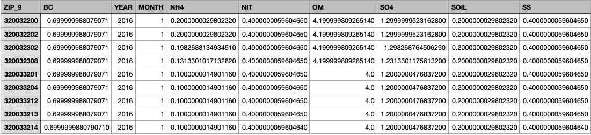

# Structure of Exposome Data
The exposome datasets follow a strict formatting convention for consistency:
    - __ZIP_9__: The geoidentifier field. Currently, all datasets are in 9-digit zip-code format only.

    - __YEAR/QUARTER/MONTH__: 
        The temporal identifiers. Resolution depends on the source data.
    - __VARIABLES__: The variables specific to the data source.

## Example
