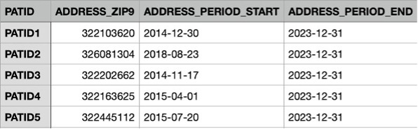

# Input Specifications

The input is a comma separated patient data set containing historical address data at the 9-digit zip-code level with the following headers:
- __PATID__:
    The unique identifier for a patient, this should be deidentified in general.
- __ADDRESS_ZIP9__:
    The 9-digit zip-code associated with this record.
- __ADDRESS_PERIOD_START__:
    The date the patient began residing in the listed zip-code.
- __ADDRESS_PERIOD_END__:
    The date the patient stopped residing in the listed zip-code.

Example:

The current input requirements are based upon the [PCORnet Common Data Model](https://pcornet.org/) __LDS_ADDRESS_HISTORY__ table. This is because the patient data we had was in this format. There is a desire to shift to a more generalized specification to accomodate data outside of this model. 