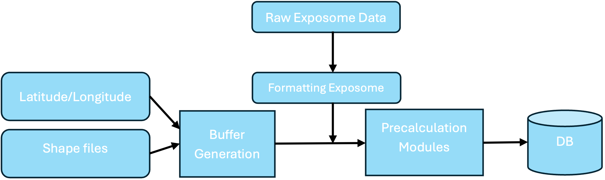

# Overview

This section outlines the standards and processes used to format and preprocess exposome data. The goal is to translate raw exposome datasets—available at various geographic granularity—into standardized outputs (currently supporting 9-digit zip-code only). The following sections describe the preprocessing pipeline, command line usage, data formatting standards, buffer creation procedures, and precalculation module.

## Breakdown of the Preprocessing Pipeline

The preprocessing pipeline is designed to precompute values for every available exposome variable based on spatiotemporal identifiers and store them in a database. The architecture consists of three primary components:

1. __Raw Data Formatting__: 
   
    Converts raw exposome data downloaded from various websites into a standardized format. This process includes adding FIPS codes, temporal scales, and consistent headers.

2. __Buffer Generation__:

    Uses shape files and lattitude/longitude data to create geographic buffers. These buffers allow calculation of the percentage overlap between a given FIPS code and another geo-identifier. (e.g. 9-digit zip-code)

3. __Precalculation Module__:

    Maps the formatted exposome data (typically divided by FIPS code and time period) onto the desired geo-identifiers using the pre-generated buffers. Currently, this module supports 9-digit zip-code with plans to generalize to other geo-identifiers. The results are then inserted into a persistent database, which is queried during runtime for study specific linkages.

### Pipeline Diagram

